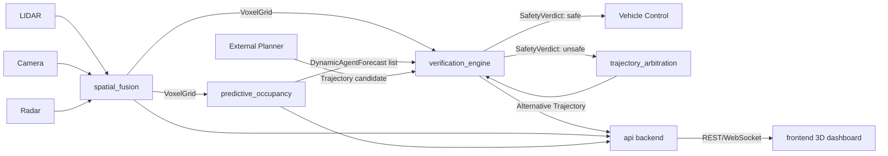

# Source Architecture — Real-Time Geometric Safety Verification Platform

This directory sketches the modules and building blocks described in the
[Implementation Plan](../PROJECT_PLAN.md#5-implementation-plan). It is a
structural scaffold (interfaces + stubs), not a finished implementation —
intended to establish module boundaries, data contracts, and backend/frontend
wiring before deep implementation begins.

## Directory Layout

```
src/
├── common/                  # Shared types & config used by every module
├── spatial_fusion/          # Phase 1 — voxelization / sensor fusion layer
├── verification_engine/     # Phase 1 — core geometric safety verification (swept volume + SDF)
├── predictive_occupancy/    # Phase 2 — GNN-based forecasting of dynamic agents
├── trajectory_arbitration/  # Phase 2 — constraint-aware, multi-objective fallback planning
├── simulation_harness/      # Phase 1/2 — benchmark + procedural/generative scenario testing
├── cross_platform/          # Phase 3 — vehicle-class generalization (robotaxi/trucking/last-mile)
├── api/                     # Backend service layer (FastAPI) wiring modules together
└── frontend/                # 3D visualization dashboard (React + Three.js / react-three-fiber)
```

## Module Responsibilities

| Module | Responsibility | Depends on |
|---|---|---|
| `common` | Shared dataclasses/types (`Trajectory`, `VoxelGrid`, `SafetyVerdict`, etc.) and config | — |
| `spatial_fusion` | LIDAR/camera/radar ingestion → probabilistic 3D occupancy (`VoxelGrid`) | `common` |
| `predictive_occupancy` | GNN forecasting of dynamic agents from occupancy history | `common`, `spatial_fusion` |
| `verification_engine` | Swept-volume + SDF verification of a candidate `Trajectory` against occupancy/forecasts | `common` |
| `trajectory_arbitration` | Multi-objective fallback trajectory generation when verification fails | `common`, `verification_engine` |
| `simulation_harness` | Scenario generation + benchmark execution across the full pipeline | all of the above |
| `cross_platform` | Vehicle-class profiles/adapters (robotaxi, trucking, last-mile) | `common` |
| `api` | REST/WebSocket backend exposing verification, simulation, and live telemetry | all of the above |
| `frontend` | 3D scene viewer + safety dashboard consuming the `api` layer | `api` (over HTTP/WS) |

## Data Flow



## Interface Contract (Planner-Agnostic Boundary)

The platform integrates with *any* AV planner solely through
[`verification_engine/interfaces.py`](verification_engine/interfaces.py):

- `SafetyVerifier.verify(trajectory, current_occupancy, forecasted_agents, min_margin_m) -> SafetyVerdict`
- `TrajectoryArbitrator.propose_alternatives(rejected_trajectory, verdict, ...) -> list[Trajectory]`

No planner-specific logic should ever live inside `verification_engine` or
`trajectory_arbitration` — this preserves the vendor-independence goal
described in the [Overview](../PROJECT_PLAN.md#3-overview).

## Backend / Frontend Split

- **Backend (`api/`)**: FastAPI service exposing `/verify`, `/simulate`, and a
  `/telemetry` WebSocket stream. Wraps the core engines as internal library
  calls — no engine logic lives in the API layer itself.
- **Frontend (`frontend/`)**: React + TypeScript app using
  `@react-three/fiber` (Three.js) to render the voxel occupancy grid,
  candidate/verified trajectories, agent forecasts, and a live safety-status
  panel, streamed over the `/telemetry` WebSocket.

## Tech Stack (proposed)

| Layer | Stack |
|---|---|
| Spatial fusion / geometry | Python, NumPy, SciPy, Open3D, scikit-image (marching cubes for SDF meshing) |
| Predictive occupancy | PyTorch, PyTorch Geometric (GNN) |
| Verification engine | Python/NumPy prototype now; candidate for Rust/C++ port later for hard real-time guarantees |
| Arbitration | SciPy/CVXPY or a custom multi-objective (NSGA-II style) optimizer |
| Backend API | FastAPI, Pydantic, Uvicorn, WebSockets |
| Frontend | React, TypeScript, Vite, `@react-three/fiber`, `@react-three/drei`, Three.js |
| Simulation harness | Python, pytest-style benchmark runner, procedural/generative scenario generators |
